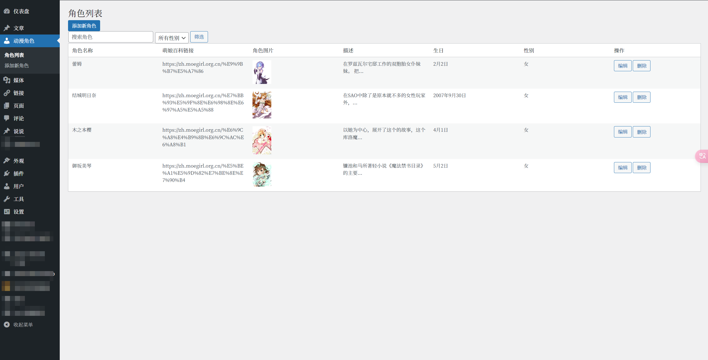
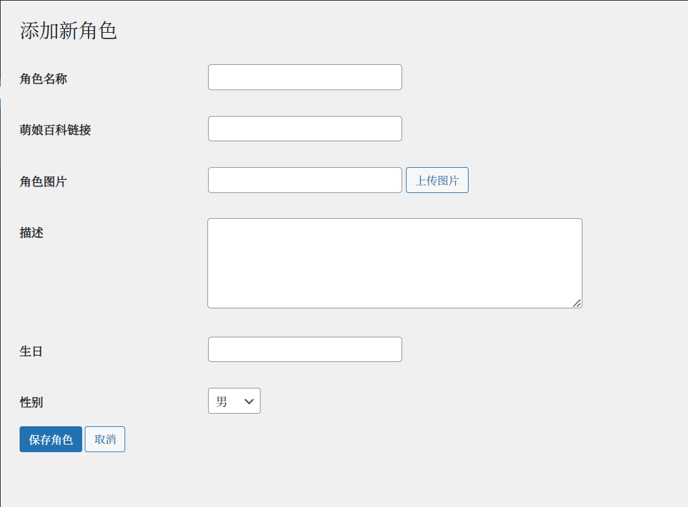
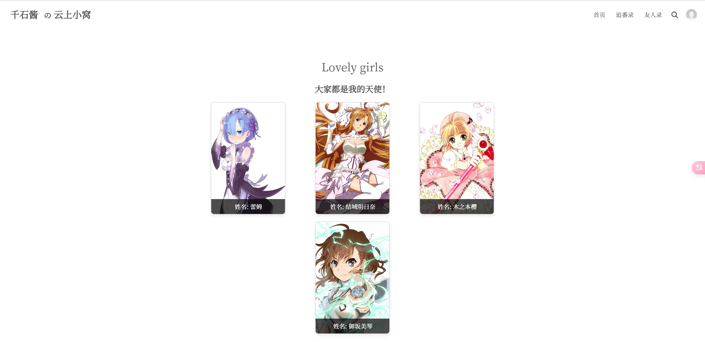

# anime-character-for-wordpress
一个管理动漫角色的插件，并在前端展示角色，灵感来源于云游君的网站: [Lovely Girls](https://yunyoujun.cn/girls/)

在线演示：https://cnqs.moe/lovely-girls/

## 说明
提供短码来展示后台设置的动漫角色
```bash
[anime_characters]
```






点击图片可以切换详细信息


## TODO
- [ ] 增加爬虫，输入角色名自动补全角色信息
